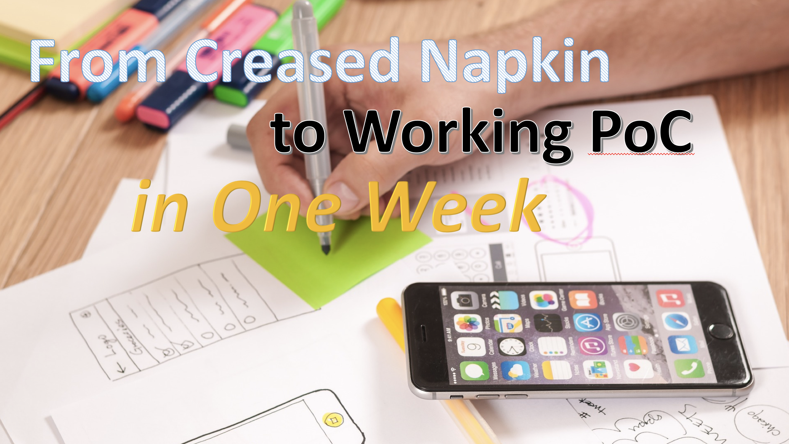

# From Creased Napkin to Working PoC in One Week

Monday 12 March 2018 | 12:45pm - 1:30pm

> With so many SAP technologies and tools, it may be difficult to determine which ones to choose to create a solid PoC for a new cloud requirement. This presentation will provide insights into the various tools and technologies, when to use what, and various tips and tricks to jumpstart development.

### Presentation

[From Creased Napkin to Working PoC in One Week](#) (Link to be added after presentation)

### Links

 - Download [Scenes](https://experience.sap.com/designservices/approach/scenes)
 - Sign up for [SAP Build](https://www.build.me)
    - A great [BUILD introduction blog](https://blogs.sap.com/2015/08/08/lets-build/) with insightful comments
 - Sign up for [SAP Cloud Platform trial]()
 - Create an [SAP HANA Multi-Database Container](https://www.sap.com/developer/tutorials/fiori-ios-scpms-geolocation.html)
     > Since the creation of an MDC is explained in a tutorial with a broader scope than just creating an MDC, simply follow steps 1-7
 - Explore [SAP API Business Hub](https://api.sap.com)
 - Log on to [SAP WEB IDE](https://www.sap.com/developer/tutorials/sapui5-webide-open-webide.html)
 - Download the [SAP Cloud Platform SDK for iOS](https://www.sap.com/developer/topics/cloud-platform-sdk-for-ios.html)

### Some additional pointers

When creating a proof of concept, your ultimate goal is to bridge the gap between expectations and reality.

So keep the following in mind:

 - What are you trying to achieve
 - What are you comparing it to
 - How long to implement
 - How will it fit current processes
 - What are the next steps
